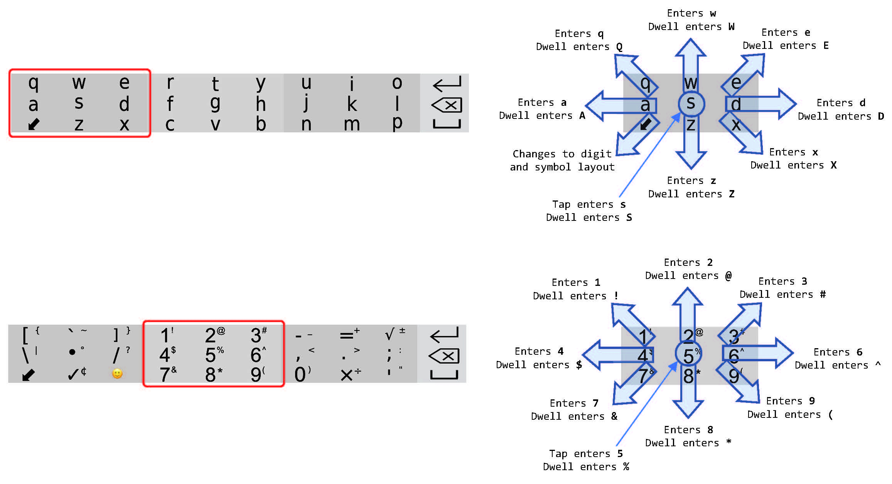
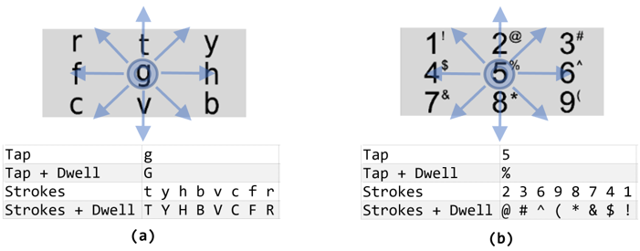
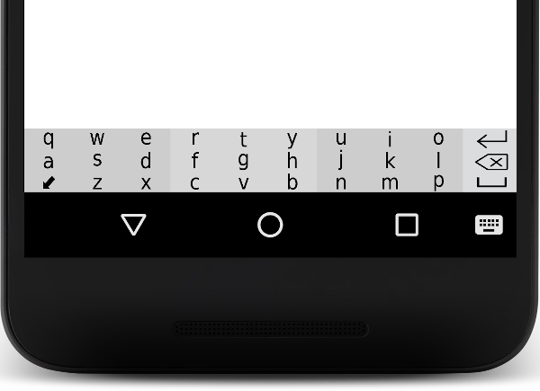
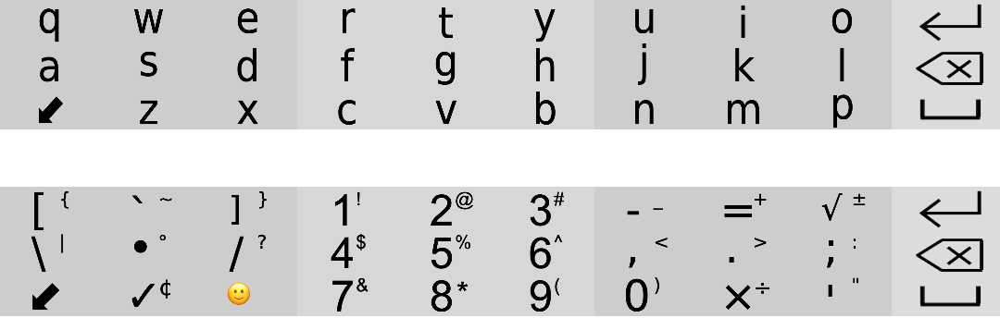
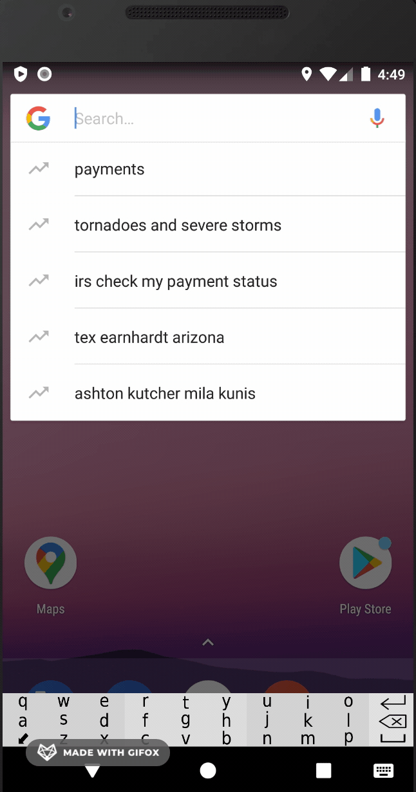
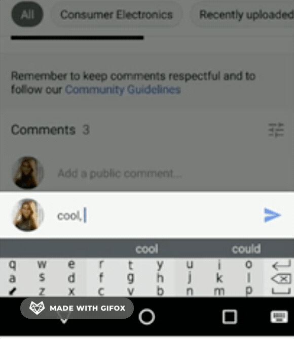
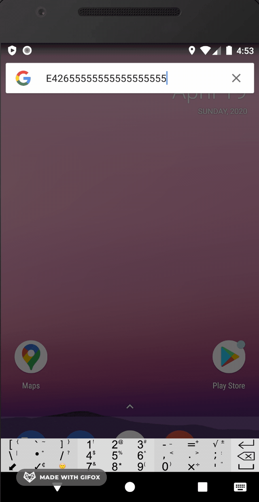

# Tapstr #
Tap And Swipe-based Keyboard For Mobile Text Entry 


## Motivation

It was a research project under the supervision of **[Assistance professor Ahmed Sabbir Arif](https://www.asarif.com/index.html)** Phd **UCMERCED**. 
Beside other things, I was motivated to develop Tapstr to appriciate amount of knowledge and work scientiest put into building such kind of software with a lot of awesome features. We use keyboards everyday not realizing or appriciating how they are developed. So this was my effort to explore, learn, understand, and build a keyboard based application.

## Description

Tapstr is a single-row reduced Qwerty that enables text entry by taps and directional strokes. It is a nonambiguous keyboard, thus does not rely on a statistical decoder. It supports the entry of uppercase and lowercase letters, numeric characters, special symbols, and emojis. Its purpose is to free up touchscreen real-estate and potentially enable text entry on smaller devices, such as smartwatches. In a user study, Tapstr yielded 11 WPM with plain phrases and 8 WPM with mixed phrases containing uppercase letters, numbers, and special symbols.
Screenshots


## Tech/framework used

Android Studio plateform with Java 


<a href="https://www.clipart.email/download/11386057.html" title="Image from clipart.email"></a>

## Demonstration

# IMAGE
 <br> <br>
<br> <br>
<br> <br>
<br>

# VISUAL


 <a></a>
 <a></a>
 <a></a>


## Code Examples
```Java
//Setting the characters to left area while stroking

    CustomView leftarea = keyboardView.findViewById(R.id.leftarea);
    leftarea.setInputConnection(this::getCurrentInputConnection);
    //"collect" converts the stream back to the list
    leftarea.setCharacters(Stream.of("s", "d", "e", "w", "q", "a", "", "z", "x").collect(Collectors.toList()));
    leftarea.setCurrentTextSetter(input -> currentInput = input);
    leftarea.setCurrentTextGetter(()-> currentInput);
```

```Java
//Capslock Function
    public void setUpperCase(boolean isUpper) {
        if (upperCase != isUpper) {
            if (isUpper) {
                characters = characters.stream()
                        .map(String::toUpperCase)
                        .collect(Collectors.toList());
            } else {
                characters = characters.stream()
                        .map(String::toLowerCase)
                        .collect(Collectors.toList());
            }
            upperCase = isUpper;
        }
    }
```

```Java
//Setting special characters
        Runnable numer =()-> {
            leftarea.setCharacters(Stream.of("•", "/", "]", "`", "[", "\\", "", "✓", "️🙂").collect(Collectors.toList()));
            centerarea.setCharacters(Stream.of("5", "6", "3", "2", "1", "4", "7", "8", "9").collect(Collectors.toList()));
            rightarea.setCharacters(Stream.of(".", ";", "√", "=", "-", ",", "0", "×", "’").collect(Collectors.toList()));
            leftarea.setType("numeric");
            centerarea.setType("numeric");
            rightarea.setType("numeric");
        };
```

## Features

1) Tap once for entering the middle letter. 

2) Flick around the zones to enter any other characters.  

3) Flick on the arrow to get the layers of the special characters. 

4) Press and Hold the main layer for 500ms to get the layers of uppercase letters (capslock). 

5) Press and Hold the first special character layers for 500ms to get more special characters. 

6) On the fourth zone, we have “Enter”, “Backspace”, and, “Space” functions accordingly. (flick up = enter, flick down = space, tap = backspace) 

7) Prediction bar at the top of the keyboard. 


## SOME BENEFITS OF THIS KEYBOARD 

* You can use it to type something in smart watches. Since smart watches have small screen this keyboard is useful because this IME is all about the gesture. For example, flicking up on the screen will give you the character “w” or “t” or “I” depend on which area of the IME users touch.  

* You can use it while watching a YouTube video on any android device  

* It can be used in the Thermostats (Example: Nest Thermostat). Since it a tap and flick keyboard it’s easier to type. You can use it to search for a Wi-Fi, or to insert your email in the thermostats and etc. 

* You can use it for game controller to use joy stick 


## Collaborator in User Studies
Gulnar Rakhmetull <br>
PhD in Electrical Engineering & Computer Science
01/2018-Current  <br>
University of California, Merced


## License
